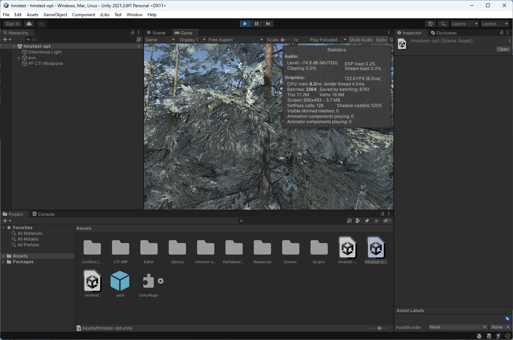

# Unity Optimization Report  

## Unity Version  
**2021.3.45f1**  

---

## Scenes Overview  

### **Scene: `hmstest.unity`**  
*Original scene used for conducting optimization.*  

---

### **Scene: `hmstest-opt.unity`**  
**Optimization Methods Applied:**  
1. **Reduce Field of View:**  
   - Adjusted from `60` → `36`  
2. **PF CTI Windzone Optimization:**  
   - Identified excessive **CTL_CustomWind** scripts running unnecessarily.  
   - Disabled per-plane massive game objects.  
   - Used a **single PF CTI Windzone** instead of multiple instances.  
3. **Enabled Static Occlusion Culling**  

**FPS Improvement:**  
- **Before Optimization:** `6 FPS`  
- **After Optimization:** `120 FPS` 🚀  

---

### **Scene: `hmstest-mod.unity`**  
- Integrated an [**open-source path generator and follower**](https://github.com/KimYC1223/UnityPathGenerator) as a base implementation.  
- Set up a **custom path** and configured the **camera to follow** the path.  

---

## Performance Improvement Screenshots 

